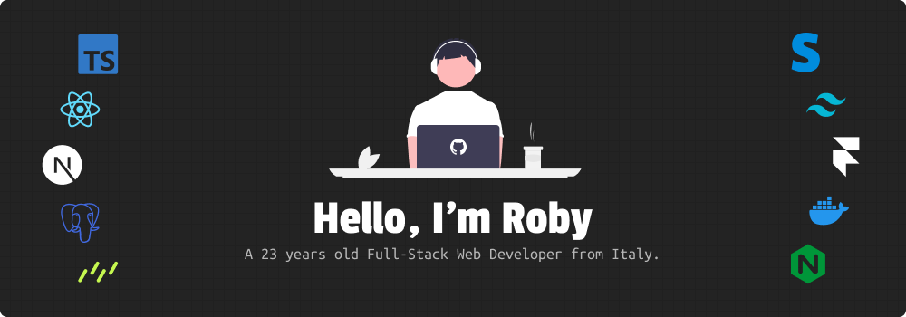

### Hello! 👋 I'm Roby, a Full-Stack Web Developer from Italy.

My passion for programming began in early 2015 when I built my first website to sell my product at the age of 14. Since then, I have gained a lot of experience and knowledge in multiple programming languages and frameworks.

I have always liked the idea of being able to turn whatever idea I had in my mind into reality, and programming was the superpower that allowed me to make that dream come true.

I am currently working as a freelancer but I am open to full-stack contract job opportunities.

###### This is my Tech Stack 👇

###### What i use to Deploy Projects 👇

> You can explore more of the projects I've developed on **[my website](https://robycodes.com/)**.
